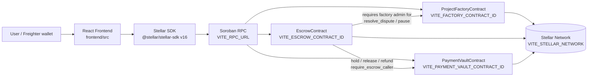
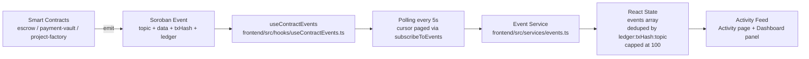
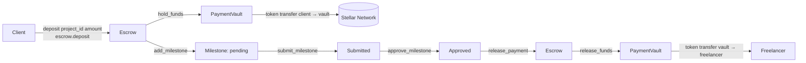

# StellarFlow

Escrow-backed milestone payments on the **Stellar Testnet**. A client and a freelancer agree on a project, money moves into a payment vault only when both sides have signed for it, milestone work is released milestone-by-milestone — and disputes pause everything until an arbitrator decides.

StellarFlow is a monorepo: three Soroban smart contracts in Rust, a React frontend, deployment scripts, and CI/CD.

---

## Overview

StellarFlow is a **smart-contract escrow dApp** for freelance milestone payments, in the spirit of Upwork/Fiverr but with the escrow enforced on-chain instead of by a platform. No middleman holds the money:

- The **escrow** contract owns projects, milestones, and disputes.
- The **payment-vault** contract physically holds and releases the funds.
- The **project-factory** contract is a minimal project registry and the identity the escrow trusts as its administrator/arbitrator.

The frontend (`frontend/`) talks to these contracts over Soroban RPC, signs everything through the **Freighter** browser wallet, and streams real on-chain events into a live activity feed.

## Problem

Freelance platforms hold client money in their own accounts. That means trust in a single company, slow payout rails, opaque dispute resolution, and no way to verify who actually holds the funds. Milestone payments also create a classic tension: the client wants proof of work before paying, the freelancer wants payment before doing more work. Neither side can force the other, so someone has to be the middleman.

## Solution

Move the middleman into code. The escrow, vault, and factory contracts encode the payment rules directly on the Stellar Testnet:

- Deposits **can only move into the vault** through `escrow.deposit`, which calls `payment_vault.hold_funds` — the money leaves the client's wallet and is held by the vault contract.
- `payment_vault.release_funds` / `refund_funds` **only accept calls from the escrow contract** (`require_escrow_caller`), so funds can never leave the vault except through the escrow's own state machine.
- The escrow releases a milestone only after `submit_milestone` → `approve_milestone` → `release_payment`, and the client or freelancer can `open_dispute` to pause the whole project until an arbitrator calls `resolve_dispute`.
- Every state change emits a Soroban **event**, and the frontend streams those events into a live activity feed — no fabricated data.

## Features

- **Wallet connection** — Freighter via `useWallet` (`frontend/src/hooks/useWallet.ts`) with distinct error handling for not-installed / declined / wrong-network, so wallet problems are explained, not swallowed.
- **Dashboard** (`frontend/src/pages/Dashboard.tsx`) — 4 stat cards, a role-filtered project grid, and a live activity panel fed by real contract events.
- **Create-project wizard** (`frontend/src/pages/CreateProject.tsx`) — Basics → Parties → Milestones → Review, then a real transaction sequence: `create_project` followed by one `add_milestone` per row. Milestone amounts must sum exactly to the project total (the contract rejects `AmountMismatch`).
- **Project details** (`frontend/src/pages/ProjectDetails.tsx`) — escrow funding line, Overview/Milestones/Activity/Dispute tabs, and a milestone timeline with role-aware actions: freelancer submits, client approves/disputes, everyone else is read-only.
- **Milestone timeline** (`frontend/src/components/milestone/MilestoneTimeline.tsx`) — a connector line whose filled portion is `paid value / total value` in exact stroops, with a node per milestone (paid / submitted / locked / disputed / cancelled).
- **Dispute flow** (`frontend/src/pages/Disputes.tsx`) — disputes reconstructed from `DISPUTE_OPENED` / `DISPUTE_RESOLVED` events, enriched with real `get_project` / `get_milestone` reads, plus arbitrator-only `resolve_dispute` controls.
- **Live activity feed** (`frontend/src/pages/Activity.tsx`) — filterable/searchable event table fed by honest RPC polling; the same events render as a compact feed on the Dashboard.
- **Transaction lifecycle UX** (`frontend/src/components/transaction/TxStatusPanel.tsx`) — building → simulating → signing → submitted → pending → confirmed (or failed with a plain-language reason), with explorer links from the moment the tx is submitted.
- **Responsive UI** (Phase 15) — desktop sidebar below 768px becomes a fixed bottom tab bar, stat cards stack, the milestone timeline compacts, and the activity table becomes stacked cards on phones.

## Architecture

The repo layout:

```
stellarflow/
├── contracts/
│   ├── project-factory/        # ProjectFactoryContract — minimal registry + admin identity
│   ├── escrow/                 # EscrowContract — projects, milestones, disputes
│   └── payment-vault/          # PaymentVaultContract — holds/releases the funds
├── frontend/
│   └── src/
│       ├── pages/              # Dashboard, Projects, ProjectDetails, Activity, Disputes, CreateProject, Settings
│       ├── components/         # SidebarNav, StatCard, ProjectCard, MilestoneTimeline, ... TxStatusPanel, WalletButton
│       ├── hooks/              # useWallet, useProjects, useProject, useMilestones, useContract, useContractEvents, useTransaction
│       ├── services/           # stellar.ts, transactions.ts, events.ts, contracts.ts
│       ├── config/             # contracts.ts — network + contract addresses from env
│       ├── types/              # project, milestone, dispute, event, transaction
│       └── utils/              # format.ts, eventMeta.ts
├── scripts/
│   ├── build-contracts.sh      # stellar contract build per crate → canonical .wasm paths
│   ├── deploy-testnet.sh       # deploy vault → escrow → factory, capture IDs
│   └── initialize-testnet.sh   # initialize in dependency order + print frontend/.env block
├── .github/workflows/
│   ├── ci.yml                  # contracts (fmt/clippy/test/wasm build) + frontend (lint/test/build)
│   └── deploy.yml              # manual or v* tag: build + deploy contracts, upload artifacts
└── Cargo.toml                  # virtual workspace (3 contract crates)
```

## Smart Contracts

All contracts are built with `soroban-sdk 27.0.3` (`[workspace.dependencies]` in the root `Cargo.toml`).

### PaymentVault — `contracts/payment-vault/`

The contract that physically holds project funds.

| Function | Signature | Notes |
|---|---|---|
| `initialize` | `(escrow: Address)` | Records the escrow contract address. The vault has **no setter** for it — it is fixed at initialize, so the escrow must be deployed first (see scripts/initialize-testnet.sh). |
| `hold_funds` | `(from, token, amount, project_id, milestone_id)` | `from.require_auth()`; transfers `token` from the client into the vault and credits `project_id`. |
| `release_funds` | `(caller, token, to, amount, project_id, milestone_id)` | `require_escrow_caller` — only the stored escrow address may release. |
| `refund_funds` | `(caller, token, to, amount, project_id)` | `require_escrow_caller`, as above. |
| `get_vault_balance` | `(project_id) -> i128` | Read-only. |

### Escrow — `contracts/escrow/`

The core state machine: owns projects, milestones, and disputes.

| Function | Signature | Notes |
|---|---|---|
| `initialize` | `(factory: Address, vault: Address)` | Stores the factory address (the escrow's admin/arbitrator) and the vault it sends funds through. |
| `create_project` | `(client, freelancer, token, total_amount) -> u32` | `client.require_auth()`; returns the new project id. |
| `add_milestone` | `(client, project_id, name, amount, due_date) -> u32` | Sum of milestone amounts must not exceed `total_amount` (`AmountMismatch`). |
| `deposit` | `(client, project_id, amount)` | Calls `payment_vault.hold_funds` and credits `escrow_balance`; capped at `total_amount`. |
| `submit_milestone` | `(freelancer, project_id, milestone_id)` | Freelancer marks pending → submitted. |
| `approve_milestone` | `(client, project_id, milestone_id)` | Client marks submitted → approved (`SelfApprovalNotAllowed` if client == freelancer). |
| `release_payment` | `(project_id, milestone_id)` | Client-signed; approved → paid via `payment_vault.release_funds`; completing the last milestone marks the project completed. |
| `open_dispute` | `(initiator, project_id, milestone_id, reason) -> u32` | Participant-signed; pauses the project (`ProjectStatus::Disputed`). |
| `resolve_dispute` | `(arbitrator, dispute_id, release_to_freelancer)` | `require_factory_admin` — only the stored factory address can resolve. |
| `cancel_project` | `(caller, project_id)` | Client-signed; project → cancelled. |
| `refund` | `(project_id)` | Client-signed; only for cancelled/disputed projects; refunds via the vault. |
| `pause` / `unpause` | `(admin)` | Factory-admin only; freezes all mutating functions. |
| `get_project` / `get_milestone` / `get_project_status` | reads | Used by the frontend (Disputes enrichment, project pages). |

### ProjectFactory — `contracts/project-factory/`

A minimal registry plus the identity the escrow trusts as arbitrator.

| Function | Signature | Notes |
|---|---|---|
| `initialize` | `(admin: Address)` | Records the governing admin. |
| `create_project` | `(client, freelancer, token, total_amount) -> u32` | Registry entry only — the cross-contract call into Escrow is `TODO(phase 4)`, so the escrow contract is the real project store. |
| `get_project` / `get_project_count` | reads | |
| `pause_project` / `unpause_project` | `(admin, project_id)` | Admin-only. |
| `transfer_admin` | `(current_admin, new_admin)` | Admin-signed. |

## Contract Interaction Diagram (Mermaid)



`frontend/src/config/contracts.ts` reads the network + RPC + the three contract IDs (plus the token) from `import.meta.env` and throws a descriptive error if any required ID is missing — no silent empty addresses.

## Event Architecture (Mermaid)

Every mutating contract function publishes a Soroban event, and Soroban RPC has **no push channel** — so the frontend's "live" feed is honest polling with an RPC cursor.



Event topics (all decoded in `frontend/src/services/events.ts`):

`FUNDS_DEPOSITED` · `MILESTONE_CREATED` · `MILESTONE_SUBMITTED` · `MILESTONE_APPROVED` · `PAYMENT_RELEASED` · `DISPUTE_OPENED` · `DISPUTE_RESOLVED` · `PROJECT_CANCELLED` · `REFUND_ISSUED` · `PROJECT_COMPLETED` · `FUNDS_HELD` · `FUNDS_RELEASED` · `FUNDS_REFUNDED` · `PROJECT_CREATED` · `PROJECT_PAUSED`

Details: `DEFAULT_POLL_INTERVAL_MS = 5000`, `DEFAULT_HISTORY_LOOKBACK_LEDGERS = 5000` (≈ a few hours on testnet). New events **prepend** into React state without a page reload, and the `ledger:txHash:topic` dedupe guards the history/subscription boundary.

## Frontend Architecture

React 18 + TypeScript + Vite, state-driven navigation (no router yet — `frontend/src/App.tsx` switches views; each page keeps its own `SidebarNav` and receives `onNavigate`).

| Layer | Where | What it does |
|---|---|---|
| Pages | `frontend/src/pages/` | Dashboard, Projects, ProjectDetails, Activity, Disputes, CreateProject, Settings |
| Components | `frontend/src/components/` | SidebarNav (desktop sidebar / mobile bottom bar), StatCard, ProjectCard, MilestoneTimeline + MilestoneDetailsModal, ActivityFeedRow, DisputeCard + OpenDisputeModal + ResolutionTimeline + ResolveDisputeControls, TxStatusPanel, WalletButton + WalletGuard, Badge/Field/Skeleton |
| Hooks | `frontend/src/hooks/` | `useWallet` (Freighter), `useTransaction` (build → simulate → sign → submit → poll), `useContractEvents` (live events), `useContract`/`useProjects`/`useProject`/`useMilestones` (contract reads) |
| Services | `frontend/src/services/` | `stellar.ts` (RPC server + network passphrase), `transactions.ts` (`buildTx`, `simulateTx`, `signAndSubmit`, `pollTxStatus`, `friendlyErrorMessage`), `events.ts` (event fetch/subscribe/decode) |
| Config | `frontend/src/config/contracts.ts` | Env-driven network + contract addresses |
| Utils | `frontend/src/utils/` | `format.ts` (stroop ↔ XLM, addresses, relative time, explorer URLs), `eventMeta.ts` (per-topic human summaries) |

Key behaviors:

- **Transactions** (`useTransaction`): one call runs the full lifecycle — `building → simulating → signing → submitted → pending → confirmed` (or `failed`). Simulation happens **before** any Freighter popup so contract reverts surface as plain-language errors. The tx hash becomes an explorer link the moment the network accepts it.
- **Role-awareness**: the milestone timeline and dispute controls derive the viewer's role by comparing `useWallet().address` to `project.client` / `project.freelancer` — never hardcoded.
- **Honesty by design**: when contract reads can't resolve (contracts not deployed yet, RPC down), pages render skeleton + explicit error states with Retry — no fabricated numbers or fake success.

## Technology Stack

| Layer | Technology |
|---|---|
| Smart contracts | Rust, `soroban-sdk 27.0.3`, `cargo` workspace (3 `cdylib` crates) |
| CLI | `stellar` CLI v21+ (`stellar contract build / deploy / invoke`) |
| Frontend | React 18, TypeScript 5, Vite 5, Tailwind CSS 3 |
| Stellar SDK (JS) | `@stellar/stellar-sdk` v16 |
| Wallet | Freighter (`@stellar/freighter-api` v5) |
| Tests | `cargo test --workspace` · Vitest + React Testing Library |
| CI/CD | GitHub Actions (`.github/workflows/ci.yml`, `deploy.yml`) |

## Installation

Prerequisites: Node 20+, Rust stable with the `wasm32-unknown-unknown` target, and the `stellar` CLI on PATH.

```bash
# 1. Install frontend deps (npm workspaces — lockfile lives at the repo root)
npm ci

# 2. Sanity-check everything works before touching a network
npm run test
npm run build
```

The contracts need no install step beyond the Rust toolchain; `scripts/build-contracts.sh` will complain with a clear message if the `wasm32` target is missing.

## Environment Variables

`frontend/.env` (see `frontend/.env.example`) — Vite exposes only `VITE_*` vars. `frontend/src/config/contracts.ts` throws a descriptive error listing the exact missing variable name if any required ID is absent.

| Variable | Required | Default | Purpose |
|---|---|---|---|
| `VITE_STELLAR_NETWORK` | no | `testnet` | `public` \| `testnet` \| `futurenet` \| `standalone` |
| `VITE_RPC_URL` | no | `https://soroban-testnet.stellar.org` | Soroban RPC endpoint |
| `VITE_FACTORY_CONTRACT_ID` | **yes** | — | project-factory contract address |
| `VITE_ESCROW_CONTRACT_ID` | **yes** | — | escrow contract address |
| `VITE_PAYMENT_VAULT_CONTRACT_ID` | **yes** | — | payment-vault contract address |
| `VITE_TOKEN_CONTRACT_ID` | **yes** | — | token (SAC) the app transacts in |

## Local Development

```bash
npm run dev        # Vite dev server → http://localhost:5173
```

- Install the **Freighter** extension and connect; the app explains every wallet failure mode (not installed / declined / wrong network) instead of showing raw errors.
- Until the contracts are deployed and the IDs above are filled in, project/milestone reads fail with explicit error states — this is intentional (no fake data). The **Activity feed is live even then**, because it streams real events from the escrow contract's recent history.
- Mobile: open DevTools device toolbar at **375px** to see the bottom tab bar layout (see `docs/responsive-375px-screenshot.md` for the required screenshot).

## Running Tests

```bash
# Smart contracts — fmt + clippy must be clean for CI
cargo fmt --check
cargo clippy -- -D warnings
cargo test --workspace

# Frontend — Vitest + ESLint + type-checked build
npm run lint      # ESLint 9 flat config (frontend/eslint.config.js)
npm run test      # Vitest (29 tests across 10 suites)
npm run build     # tsc -b && vite build
```

## Building Contracts

```bash
./scripts/build-contracts.sh
```

Runs `stellar contract build --package <crate>` for each of `stellarflow-payment-vault`, `stellarflow-escrow`, and `stellarflow-project-factory`, then copies each `.wasm` to a canonical path:

```
contracts/<crate>/target/wasm32-unknown-unknown/release/<crate>.wasm
```

Those paths are what `scripts/deploy-testnet.sh` and the CI deploy workflow consume.

## Deploying Contracts

Deploy, then initialize — the scripts enforce dependency order and never hardcode keys:

```bash
# 1. Deploy vault → escrow → factory, capturing the returned contract IDs
STELLAR_ACCOUNT=<key-name-or-path> ./scripts/deploy-testnet.sh

# 2. Initialize in dependency order (vault first — it records the escrow's
#    address at initialize, so the escrow must already be deployed)
VAULT_ID=... ESCROW_ID=... FACTORY_ID=... \
STELLAR_ACCOUNT=<key-name-or-path> \
TOKEN_CONTRACT_ID=<token-or-sac-id> \
./scripts/initialize-testnet.sh
```

`initialize-testnet.sh` prints a ready-to-paste `.env` block (the exact `VITE_*` names above) after all three `initialize` calls return 0. Every credential is a `${VAR:?set VAR}` placeholder; the scripts claim nothing — the CLI's exit codes are the only signal.

## Testnet Configuration

The `stellar` CLI needs a network and a funded account before the scripts above will work:

```bash
# Register testnet (if not already present)
stellar network add --global testnet \
  --rpc-url https://soroban-testnet.stellar.org \
  --network-passphrase "Test SDF Network ; September 2015"

# Create a key and fund it via the testnet faucet
stellar keys generate <name> --network testnet --fund
# (or import an existing key:  stellar keys add <name>)
```

Then use `<name>` as `STELLAR_ACCOUNT`. The frontend must run on the same network (`VITE_STELLAR_NETWORK=testnet`) — `useWallet` compares Freighter's passphrase against `getNetworkPassphrase()` and flags a `wrong-network` error otherwise.

## Contract Addresses

Placeholders — fill these from `scripts/deploy-testnet.sh` + `scripts/initialize-testnet.sh` output once real deployment has run:

| Contract | Environment variable | Address (fill after deployment) |
|---|---|---|
| ProjectFactory | `VITE_FACTORY_CONTRACT_ID` | `C...` |
| Escrow | `VITE_ESCROW_CONTRACT_ID` | `C...` |
| PaymentVault | `VITE_PAYMENT_VAULT_CONTRACT_ID` | `C...` |
| Token (SAC) | `VITE_TOKEN_CONTRACT_ID` | `C...` |

## Transaction Examples

All examples use the `stellar` CLI and the placeholder IDs from the `.env` block. Amounts are stroops (`1 XLM = 10_000_000`); `--send=yes` submits state-changing invokes on recent CLI versions (the init script auto-detects it).

```bash
# Create a project (client signs)
stellar contract invoke --id "$ESCROW_ID" --source client --network testnet --send=yes -- \
  create_project "$CLIENT" "$FREELANCER" "$TOKEN" 1000000000

# Add a milestone (amounts must sum to the project total)
stellar contract invoke --id "$ESCROW_ID" --source client --network testnet --send=yes -- \
  add_milestone "$CLIENT" 1 "Homepage" 500000000 2000000000

# Fund the escrow → vault.hold_funds moves the client's tokens into the vault
stellar contract invoke --id "$ESCROW_ID" --source client --network testnet --send=yes -- \
  deposit "$CLIENT" 1 1000000000

# Freelancer submits, client approves, client releases → vault pays the freelancer
stellar contract invoke --id "$ESCROW_ID" --source freelancer --network testnet --send=yes -- \
  submit_milestone "$FREELANCER" 1 1
stellar contract invoke --id "$ESCROW_ID" --source client --network testnet --send=yes -- \
  approve_milestone "$CLIENT" 1 1
stellar contract invoke --id "$ESCROW_ID" --source client --network testnet --send=yes -- \
  release_payment 1 1

# Dispute path (participant opens, factory admin resolves)
stellar contract invoke --id "$ESCROW_ID" --source freelancer --network testnet --send=yes -- \
  open_dispute "$FREELANCER" 1 1 "Deliverable missing half the scope"
stellar contract invoke --id "$ESCROW_ID" --source factory-arbitrator --network testnet --send=yes -- \
  resolve_dispute "$FACTORY_ARBITRATOR" 1 true
```

### Payment Flow



Funds are only ever moved by the vault's `hold_funds` / `release_funds` / `refund_funds`, and the vault rejects any caller other than the escrow contract.

## CI/CD

- **`.github/workflows/ci.yml`** — on push/PR to `main`:
  - `contracts` job: `cargo fmt --check` → `cargo clippy -- -D warnings` → `cargo test --workspace` → `cargo build --target wasm32-unknown-unknown --release`.
  - `frontend` job: `npm ci` → `npm run lint` → `npm run test` → `npm run build`.
  - No `continue-on-error` — any non-zero exit fails the workflow.
- **`.github/workflows/deploy.yml`** — **explicit triggers only** (`workflow_dispatch` or a `v*` tag): runs `scripts/build-contracts.sh` → `scripts/deploy-testnet.sh` and uploads the `.wasm` files + `contract-ids.*` as build artifacts. The frontend is never deployed as a side effect of this workflow.

## Security Considerations

- **Authentication at the contract layer** — every mutating function calls `require_auth()` on the acting address (`client`, `freelancer`, `admin`, `arbitrator`), so a transaction only succeeds if the wallet signed it.
- **Least privilege in the vault** — `require_escrow_caller` means the vault trusts exactly one address (the escrow set at `initialize`); `release_funds`/`refund_funds` cannot be called by anyone else.
- **Escrow admin gating** — `resolve_dispute`, `pause`, and `unpause` require the caller to equal the factory address stored at `escrow.initialize` (`require_factory_admin`).
- **Simulate before sign** — the frontend simulates every transaction on-chain and decodes the result before opening the Freighter signing popup, so contract reverts (and clear error messages) happen without burning a signature.
- **Network guard** — `useWallet` compares the wallet's network passphrase to `getNetworkPassphrase()`; wrong-network connections are flagged rather than acted on.
- **No secrets in the repo** — all scripts use `${VAR:?}` placeholders; keys live in the `stellar` CLI keyring or env.

## Known Limitations

- **Factory → Escrow wiring is a TODO** — `project-factory`'s `create_project` only writes a registry entry; the escrow contract is the real project store. The factory's main production role today is being the address the escrow trusts as admin/arbitrator.
- **Vault has no `set_escrow` setter** — the escrow address is fixed at `vault.initialize`, so changing it requires redeploying the vault.
- **No token deployment in the scripts** — `TOKEN_CONTRACT_ID` must be supplied (e.g. the XLM SAC or a separately deployed token).
- **Contract reads need a real deployment** — until the IDs are filled into `frontend/.env`, project/milestone pages show honest error states by design.
- **Dispute records are event-derived** — an open dispute's id is approximated from event order until its resolution event carries the authoritative id; history is limited to the recent ledgers window.
- **No push channel** — the activity feed is 5-second polling with an RPC cursor (documented in `services/events.ts`), not a websocket.
- **State-driven navigation** — no router yet; view switching lives in `frontend/src/App.tsx`.
- **CI contracts job** requires rustfmt/clippy-clean code (`cargo fmt --check`, `clippy -D warnings`).

## Future Improvements

- Wire the factory's `create_project` to call into the escrow (cross-contract).
- Add a `set_escrow` / two-step init pattern to the vault for upgradeability.
- Add a token deployment step (XLM SAC) so the `.env` block is fully self-contained.
- Introduce a router and extract a shared app-shell component.
- Expand contract and frontend test coverage, plus a CI smoke test that boots the built frontend.
- Automate the 375px screenshot capture in CI (see `docs/responsive-375px-screenshot.md`).
- Mainnet readiness pass (network config, fees, security review).

## Screenshots

> Placeholder — screenshots to be added to the submission.

- **Desktop (1440px)** — `docs/screenshots/desktop-1440.png` *(required)*
- **Tablet (768px)** — `docs/screenshots/tablet-768.png`
- **Mobile (375px)** — `docs/screenshots/mobile-375.png` *(required for the submission checklist — see `docs/responsive-375px-screenshot.md` for the exact DevTools device-toolbar steps)*

## Live Demo

> Placeholder — no live deployment yet. The frontend runs locally via `npm run dev` (see Local Development), and the contracts run on Testnet after following Deploying Contracts.

## Demo Video

> Placeholder — a short walkthrough video will be linked here once recorded (connect wallet → create project → deposit → submit/approve/release → open and resolve a dispute).

## License

> No LICENSE file is committed yet. Choose and add one (e.g. MIT) before publishing; until then, all rights reserved by default.
